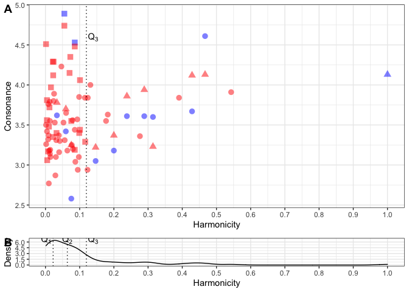
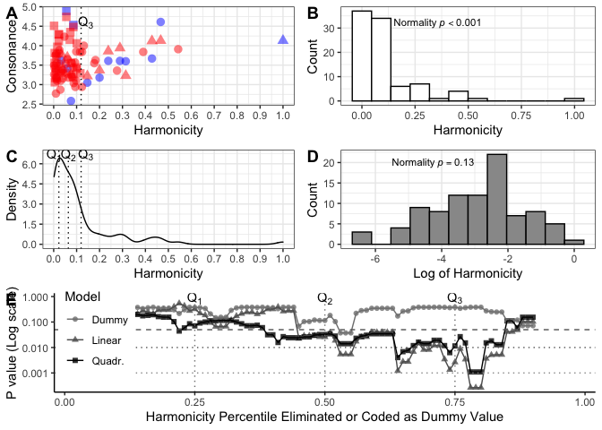

<!-- README.md is generated from README.Rmd. Please edit that file -->

# Re-analysis of consonance and harmonicity in Friedman et al., (2021) data

<!-- badges: start -->
<!-- badges: end -->

This repository contains a re-analysis of Friedman et al., (2021) data
about consonance in Bohlen-Pierce dyads/triads. Our starting point their
data (under data folder) and the analysis by Bowling (2021).

## Loading the data

``` r
library(tidyr)
library(ppcor)
#> Loading required package: MASS
library(ggplot2)

source('read_data.R')
head(as_tibble(df))
#> # A tibble: 6 x 17
#>      ID Tone.1 Tone.2  Hz.1  Hz.2 Overall Piano Clarinet Tone.3  Hz.3 Type 
#>   <dbl>  <dbl>  <dbl> <dbl> <dbl>   <dbl> <dbl>    <dbl>  <dbl> <dbl> <chr>
#> 1     1      0      1  252.  272.    2.58  2.25     2.84     NA    NA Dyad 
#> 2     2      0      2  239.  284.    4.53  4.68     4.41     NA    NA Dyad 
#> 3     3      0      3  229.  294.    3.61  3.73     3.52     NA    NA Dyad 
#> 4     4      0      4  218.  305.    3.6   3.28     3.87     NA    NA Dyad 
#> 5     5      0      5  207.  316.    3.62  3.77     3.5      NA    NA Dyad 
#> 6     6      0      6  196.  327.    4.61  4.44     4.75     NA    NA Dyad 
#> # … with 6 more variables: Nro <int>, NRO <int>, BHM <dbl>, HPHM <dbl>,
#> #   SIM <dbl>, Familiar <fct>
# BHM   Bowling Harmonicity
# HPHM  Harrison Pearce Harmonicity
# SIM   Huthinson and Knopoff
```

### Replicate Bowling correlations

``` r
source('correlational_analysis.R')
#> [1] "r=0.147, p-value=0.98391"
#> [1] "r=-0.746, p-value=0"
#> [1] "pr_p=-0.192, p-value=0.42279"
#> [1] "spr_p=-0.128, p-value=1.38278"
#> [1] "pr_p=-0.75, p-value=0"
#> [1] "spr_p=-0.742, p-value=0"
```

### Replicate Bowling’s plot (B and D)

``` r
source('figure1.R')
print(fig1)
```



### Impact of controversial trimming

``` r
source('correlational_analysis_after_trimming_pearson.R')
#> [1] "r=0.147, p-value=0.98391"
#> [1] "r=0.272, p-value=0.26606"
#> [1] "r=0.562, p-value=0.02069"
#> [1] "pr_p=-0.192, p-value=0.42279"
#> [1] "pr_p=-0.015, p-value=5.49429"
#> [1] "pr_p=0.211, p-value=1.9294"
#> [1] "spr_p=-0.128, p-value=1.38278"
#> [1] "spr_p=-0.01, p-value=5.66333"
#> [1] "spr_p=0.159, p-value=2.75527"
#> [1] "r=-0.746, p-value=0"
#> [1] "r=-0.747, p-value=0"
#> [1] "r=-0.661, p-value=0.00193"
#> [1] "pr_p=-0.75, p-value=0"
#> [1] "pr_p=-0.723, p-value=0"
#> [1] "pr_p=-0.462, p-value=0.13831"
#> [1] "spr_p=-0.742, p-value=0"
#> [1] "spr_p=-0.695, p-value=0"
#> [1] "spr_p=-0.382, p-value=0.39251"
```

### Analysis of varying thresholds

``` r
source('varying_thresholds.R')
print(combo)
```



## References

Bowling, D. L. (2021). Harmonicity and roughness in the biology of tonal
aesthetics. *Music Perception: An Interdisciplinary Journal, 38 (3)*,
331–334.

Friedman, R. S., Kowalewski, D. A., Vuvan, D. T., & Neill, W. T. (2021).
Consonance preferences within an unconventional tuning system. *Music
Perception: An Interdisciplinary Journal, 38(3)*, 313–330.
