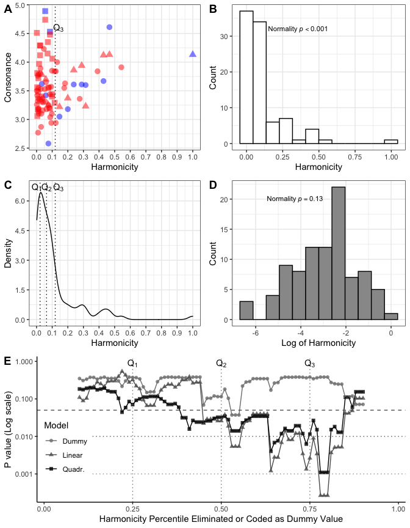

<!-- README.md is generated from README.Rmd. Please edit that file -->

# Re-analysis of consonance and harmonicity in Friedman et al. data

<!-- badges: start -->
<!-- badges: end -->

This repository contains a re-analysis of Friedman et al. (2021) data
about consonance in Bohlen-Pierce dyads/triads. Our starting point is
their data and the analysis by Bowling (2021). The sources of the data
are:

-   `table1.txt` and `table2.txt` in the `/data` contain stimulus
    details and dyads and triads and consonance ratins and come from
    Friedman et al. article:
    <https://online.ucpress.edu/mp/article/38/3/313/116134/Consonance-Preferences-Within-an-Unconventional>

-   `model1.txt` and `model2.txt` `/data` contain harmonicity and
    roughness models and are extracted from supplementary data of the
    Friedman et al. article:
    <https://ucp.silverchair-cdn.com/ucp/content_public/journal/mp/38/3/10.1525_mp.2021.38.3.313/2/5_friedman_etal_supplementary_data.pdf>

## Loading the data

``` r
library(tidyr)
library(ppcor)
library(ggplot2)

source('read_data.R')
head(as_tibble(df))
#> # A tibble: 6 x 17
#>      ID Tone.1 Tone.2  Hz.1  Hz.2 Overall Piano Clarinet Tone.3  Hz.3 Type 
#>   <dbl>  <dbl>  <dbl> <dbl> <dbl>   <dbl> <dbl>    <dbl>  <dbl> <dbl> <chr>
#> 1     1      0      1  252.  272.    2.58  2.25     2.84     NA    NA Dyad 
#> 2     2      0      2  239.  284.    4.53  4.68     4.41     NA    NA Dyad 
#> 3     3      0      3  229.  294.    3.61  3.73     3.52     NA    NA Dyad 
#> 4     4      0      4  218.  305.    3.6   3.28     3.87     NA    NA Dyad 
#> 5     5      0      5  207.  316.    3.62  3.77     3.5      NA    NA Dyad 
#> 6     6      0      6  196.  327.    4.61  4.44     4.75     NA    NA Dyad 
#> # … with 6 more variables: Nro <int>, NRO <int>, BHM <dbl>, HPHM <dbl>,
#> #   SIM <dbl>, Familiar <fct>
# BHM   Bowling Harmonicity model
# HPHM  Harrison Pearce Harmonicity model
# SIM   Huthinson and Knopoff Roughness model (Spectral Interference Model)
```

### Replicate Bowling’s Figure 1

Plot panels B and D in Figure 1 of Bowling’s article (p. 332). We
display three quartiles (*Q*<sub>1</sub>, *Q*<sub>2</sub>,
*Q*<sub>3</sub>) on top of the distributions and show more accurate
density distribution below (panel B).

``` r
source('figure1.R')
print(fig1)
```

<div class="figure">


<p class="caption">
Bowling’s visualisation of the data with the actual quartiles. Dyads are
blue and triads are red. Squares are BP intervals 2/11 and triangles
refer to BP interval 13.
</p>

</div>

### Replicate Bowling correlations

Spearman rank correlations with skewed harmonicity variable.

``` r
# correlational_analysis_with_rank.R
# Does not contain adjustment for multiple corrections

# Rank correlations between harmonicity and consonance, full data
rho<-cor.test(df$Overall,df$BHM,method='spearman',exact = FALSE) 
print(round(rho$estimate,3))  # 0.161 (0.162 in Bowling Figure 1, panel B, p. 332)
#>   rho 
#> 0.161

# Rank correlations between harmonicity and consonance, Chromatic excluded
rho <- cor.test(df$Overall[df$Familiar=='No'],df$BHM[df$Familiar=='No'],method = 'spearman',exact = FALSE) 
print(round(rho$estimate,3))  # 0.274 (0.273 in Bowling)
#>   rho 
#> 0.274

# Rank correlations between harmonicity and consonance, All low harmonicity intervals eliminated
rho <- cor.test(df$Overall[df$BHM>0.1068],df$BHM[df$BHM>0.1068],method = 'spearman',exact = FALSE) 
print(round(rho$estimate,3))  # 0.550 (0.543 in Bowling)
#>  rho 
#> 0.55
```

### Is harmonicity skewed and can it be fixed?

A more efficient way to analyse the data is to address the skewness of
the harmonicity variable before applying linear models.

``` r
library(nortest) # Library for normality tests
ad.test(df$BHM) # Anderson test
#> 
#>  Anderson-Darling normality test
#> 
#> data:  df$BHM
#> A = 8.9242, p-value < 2.2e-16
ad.test(log(df$BHM))
#> 
#>  Anderson-Darling normality test
#> 
#> data:  log(df$BHM)
#> A = 0.57552, p-value = 0.1312
```

In short, harmonicity (BHM) is highly non-normally distributed but after
log transformation it no longer violates normality which these two
Anderson tests of normality demonstrate. For the visualisation of the
original and transformed distributions of harmonicity, see the figure
below that shows the histograms (panels B and D).

### Impact of controversial trimming

Calculate all correlations, partial correlations and semi-partial
correlations between consonance, harmonicity and roughness with full
data, chromatic exclusion and low harmonicity exclusion using pearson
correlations. In this analysis, harmonicity has been log transformed to
eliminate the skewness. For the details of the calculation, see script
(`correlational_analysis_after_trimming_pearson.R`).

| predictor   | subset                |   n |      r |     pr |    spr | r\_pval | pr\_pval | spr\_pval |
|:------------|:----------------------|----:|-------:|-------:|-------:|--------:|---------:|----------:|
| Harmonicity | Full                  |  91 |  0.147 | -0.192 | -0.128 |   0.984 |    0.423 |     1.383 |
| Harmonicity | Chromatic excl.       |  55 |  0.272 | -0.015 | -0.010 |   0.266 |    5.494 |     5.663 |
| Harmonicity | Low Harmonicity excl. |  25 |  0.562 |  0.211 |  0.159 |   0.021 |    1.929 |     2.755 |
| Roughness   | Full                  |  91 | -0.746 | -0.750 | -0.742 |   0.000 |    0.000 |     0.000 |
| Roughness   | Chromatic excl.       |  55 | -0.747 | -0.723 | -0.695 |   0.000 |    0.000 |     0.000 |
| Roughness   | Low harmonicity excl. |  25 | -0.661 | -0.462 | -0.382 |   0.002 |    0.138 |     0.393 |

Table 1. Model correlations with consonance ratings and with Roughness
or Harmonicity partialled out.

### Analysis of varying thresholds

What happens with different data exclusions (using percentiles from 10%
to 90%). Compare linear, quadratic and dummy coded models with null
models with the same data subsets.

``` r
# varying_thresholds.R

#### Let's explore the trimming systematically -------------
a1<-NULL; a2<-NULL; a3<-NULL
s<-seq(0.10,0.90,by=0.01)
for (i in s) {
  tmp<-dplyr::filter(df,BHM >= quantile(BHM,i))
  model0<-lm(Overall ~ 1,data = tmp)
  model1<-lm(Overall ~ log(BHM),data = tmp)
  model2<-lm(Overall ~ log(BHM)+ I(log(BHM)^2),data = tmp)
  
  df$dummy<-0
  df$dummy[df$BHM < as.numeric(quantile(df$BHM,i))]<- 1
  modeldummy<-lm(Overall ~ log(BHM) + dummy,data = df)
  model0dummy<-lm(Overall ~ 1,data = df)
  
  x1<-anova(model0,model1)
  a1<-rbind(a1,x1$`Pr(>F)`[2])

  x2<-anova(model0,model2)
  a2<-rbind(a2,x2$`Pr(>F)`[2])
  
  x3<-anova(model0dummy,modeldummy)
  a3<-rbind(a3,x3$`Pr(>F)`[2])
}

tmpf <- data.frame(pval=c(a1,a2,a3),Q=c(s,s,s),model=c(rep('Linear',length(a2)),rep('Quadr.',length(a2)),rep('Dummy',length(a2))))

g5<-ggplot(tmpf,aes(Q,pval,colour=model,shape=model))+
  geom_point(size=1.75,alpha=0.80)+
  geom_line()+
  scale_x_continuous(limits = c(0.0,1),breaks = seq(0,1,by=0.25),expand = c(0.01,0.01))+
  scale_y_continuous(trans = 'log10')+
  scale_shape(name='Model')+
  scale_color_grey(start = .5,end = 0.0,name='Model')+
  geom_hline(yintercept = 0.05,colour='grey40',linetype='dashed')+
  geom_hline(yintercept = 0.01,colour='grey40',linetype='dotted')+
  geom_hline(yintercept = 0.001,colour='grey60',linetype='dotted')+
  geom_vline(xintercept = 0.25,colour='grey50',linetype='dotted')+
  geom_vline(xintercept = 0.50,colour='grey50',linetype='dotted')+
  geom_vline(xintercept = 0.75,colour='grey50',linetype='dotted')+
  annotate("text",x=0.25,y=0.9,label='Q[1]',parse=TRUE)+
  annotate("text",x=0.50,y=0.9,label='Q[2]',parse=TRUE)+
  annotate("text",x=0.75,y=0.9,label='Q[3]',parse=TRUE)+
  xlab('Harmonicity Percentile Eliminated or Coded as Dummy Value')+
  ylab('P value (Log scale)')+
  theme_bw()+
  theme(legend.justification=c(1,0), legend.position=c(0.15,0.15))+
  theme(panel.border = element_blank(), panel.grid.major = element_blank(),panel.grid.minor = element_blank(), axis.line = element_line(colour = "black"))

g3<-ggplot(df,aes(x=BHM))+
  geom_histogram(fill='white',colour='black',bins=12)+
  ylab('Count')+
  xlab('Harmonicity')+
  annotate("text",x=.15,y=32,label="Normality~italic(p)<.001",parse=TRUE,size=3,hjust=0)+
  theme_bw()

g4<-ggplot(df,aes(x=log(BHM)))+
  geom_histogram(fill='grey60',colour='black',bins = 12)+
  ylab('Count')+
  xlab('Log of Harmonicity')+
  annotate("text",x=-5.5,y=20,label="Normality~italic(p)==.13",parse=TRUE,size=3,hjust=0)+
  theme_bw()

library(cowplot)
first_row = plot_grid(g1,g3, labels = c('A','B'), nrow = 1)
second_row = plot_grid(g2,g4, labels = c('C', 'D'), nrow = 1)
third_row = plot_grid(g5, labels = c('E'), nrow = 1)

combo = plot_grid(first_row, second_row, third_row, labels=c('', ''), ncol=1)
print(combo)
```

<div class="figure">


<p class="caption">
Figure 1 in our response that captures all issues.
</p>

</div>

## References

Bowling, D. L. (2021). Harmonicity and roughness in the biology of tonal
aesthetics. *Music Perception: An Interdisciplinary Journal, 38 (3)*,
331–334.

Friedman, R. S., Kowalewski, D. A., Vuvan, D. T., & Neill, W. T. (2021).
Consonance preferences within an unconventional tuning system. *Music
Perception: An Interdisciplinary Journal, 38(3)*, 313–330.
